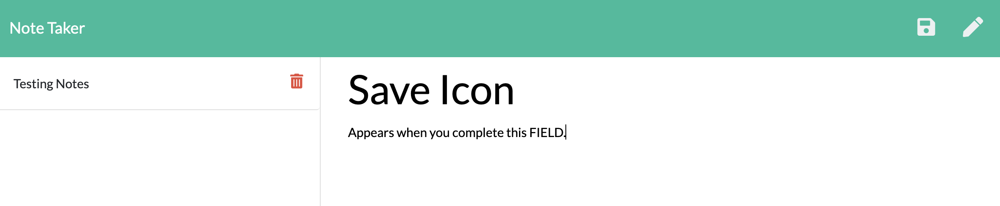

# Note Taker

GitHub Repository Link: https://github.com/WitnessMyHands/Express-Note-Taker

Heroku Link (not working, even after 'Procfile' and 'process.env.' added)
[Link to BROKEN Heroku Live Site](https://wmh-note-taker.herokuapp.com/)

## Table of Contents

- [Information](#Information)
- [Usage](#Usage)
- [Errors](#Errors)
- [Questions](#Questions)

## Information

The note taker application allows for users to write, save and delete two notes organized with a note title and text area. The application was created using express.js to retrieve the user input data.

The site features:
* Express.js
* Node.js
* Heroku (used for site Deployment)

## Usage

To run this application correctly follow these instructions:

* install npm init -y
* npm i express
* node server

From there, click on the "Get Started" Button which will direct you to the /notes page allowing you to input pertinent information for the Note Title and Text Area.

Once the user fills the "Note Text" area, the 'Save' Icon appears at the Top Right of the Browser allowing the user to Save their data.

Your note will appear on the left hand column with the given Note Title. The delete function is accessible to the user once the note is no longer needed.

## Errors

If the Port is already in use, I found this to be an effective way of running the application successfully.

In Terminal / Command Prompt:

`lsof -i tcp:__(PORT NUMBER)__`

`kill -9 __(PID)__`

## Questions
*Please contact WitnessMyHands via GitHub with any questions or concerns.*

- https://github.com/WitnessMyHands
